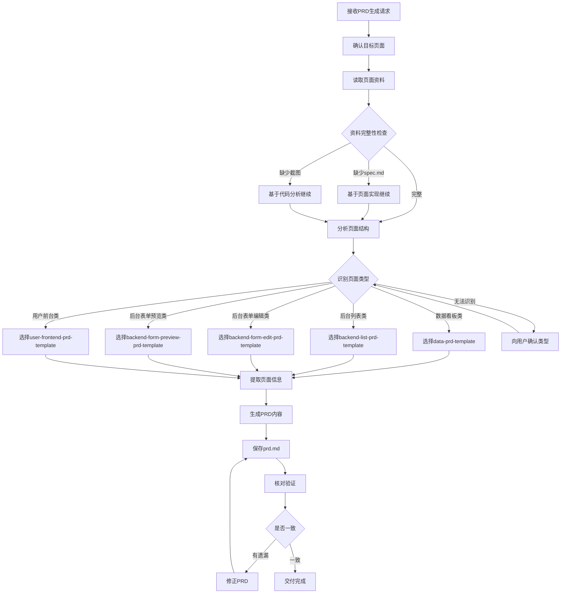

# PRD Generator 工作流程

## 完整工作流

## 步骤详解

### Step 1: 接收请求

确认以下信息：
- 目标页面路径
- 需求范围（全页面/特定模块）
- 是否有额外的需求补充

### Step 2: 读取资料

按优先级读取：
1. `index.tsx` - 必读，页面主组件
2. `spec.md` - 优先读取，规格说明
3. `content.md` - 优先读取，内容配置
4. `screenshot.png` - 优先读取，视觉参考

### Step 3: 识别页面类型

通过以下特征识别：

| 类型 | 关键特征 |
|------|---------|
| 数据看板类 | Chart组件、Statistic卡片、Dashboard布局 |
| 后台列表类 | Table组件、Filter筛选、Pagination分页 |
| 后台表单编辑类 | Form组件、Input字段、Submit按钮 |
| 后台表单预览类 | Descriptions组件、只读展示、无编辑按钮 |
| 用户前台类 | 商品卡片、购物车、用户交互组件 |

### Step 4: 提取页面信息

提取内容：
- 功能模块划分
- 字段定义（名称、类型、验证规则）
- 按钮操作（新增、编辑、删除、导出等）
- 交互逻辑（联动、校验、提示）
- 状态管理（加载、空状态、错误状态）
- 权限控制（查看、编辑、删除权限）
- 异常场景（网络错误、数据异常）

### Step 5: 生成PRD

按模板结构填充：
1. 引言（背景、功能清单）
2. 页面菜单与权限规划
3. 各模块需求说明
4. 交互设计
5. 异常处理

### Step 6: 核对验证

检查项：
- [ ] PRD功能点与页面实现一致
- [ ] 字段定义与代码定义一致
- [ ] 权限规划与实际权限一致
- [ ] 无遗漏的关键功能
- [ ] 无编造的不存在功能

## 异常处理流程

| 异常情况 | 处理方式 |
|---------|---------|
| 页面类型无法识别 | 向用户展示特征，请求确认 |
| 资料严重缺失 | 基于代码分析生成，标注待确认项 |
| 页面过于复杂 | 拆分模块，逐个生成后合并 |
| 发现功能矛盾 | 标注矛盾点，请求用户澄清 |
