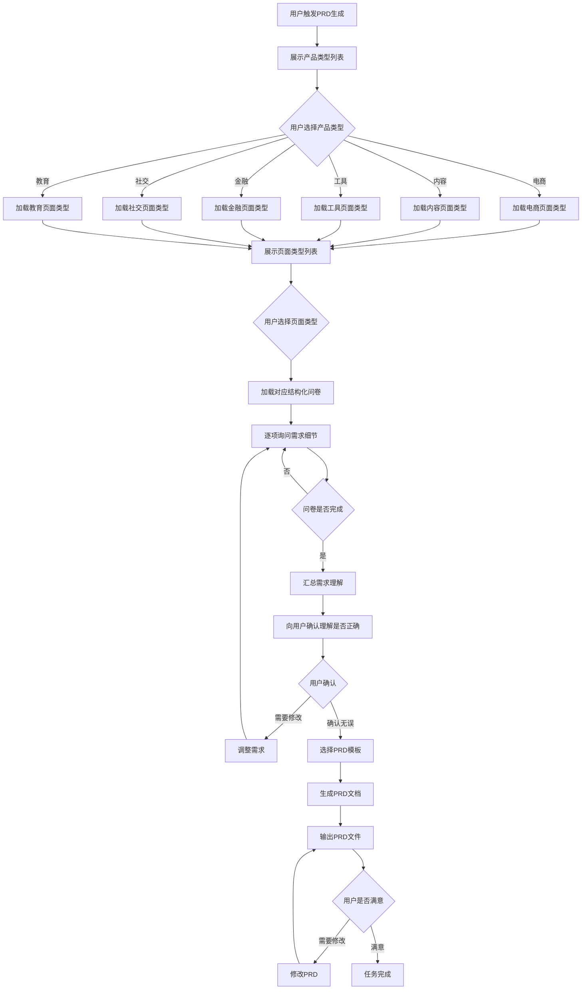

# PRD Creator 工作流程

## 完整工作流



## 步骤详解

### Step 1: 触发PRD生成

用户通过以下方式触发：
- "帮我写一个XXX页面的PRD"
- "生成商品详情页的PRD"
- "我需要一个用户管理的需求文档"

### Step 2: 选择产品类型

展示产品类型列表，让用户选择：

| 序号 | 产品类型 | 说明 |
|------|---------|------|
| 1 | 电商类 | 电商平台、商城、O2O等 |
| 2 | 内容类 | 资讯、社区、博客、视频等 |
| 3 | 工具类 | 效率工具、管理系统等 |
| 4 | 金融类 | 支付、理财、保险等 |
| 5 | 社交类 | IM、社交网络、论坛等 |
| 6 | 教育类 | 在线教育、学习平台等 |

### Step 3: 选择页面类型

根据产品类型动态展示可选页面类型：

**电商类页面类型**：
- 首页、商品列表、商品详情、购物车、结算页、订单列表、订单详情、个人中心、会员中心、活动页

**内容类页面类型**：
- 首页、内容列表、内容详情、搜索页、个人中心、发布页、评论页

**工具类页面类型**：
- 首页、功能页、设置页、数据管理、列表页、表单页、详情页

**金融类页面类型**：
- 首页、产品列表、产品详情、交易页、账单页、资产页、设置页

**社交类页面类型**：
- 首页、动态流、个人主页、消息页、发布页、设置页

**教育类页面类型**：
- 首页、课程列表、课程详情、学习页、作业页、个人中心

### Step 4: 结构化问卷

逐项询问需求细节，问卷维度：

| 维度 | 问题示例 |
|------|---------|
| **页面定位** | 页面名称？核心功能是什么？目标用户是谁？使用场景是什么？ |
| **功能模块** | 包含哪些功能模块？每个模块的功能点是什么？功能优先级如何？ |
| **字段定义** | 需要哪些字段？字段类型？是否必填？验证规则？默认值？ |
| **交互规则** | 用户操作流程？状态如何变化？有无联动逻辑？ |
| **权限规划** | 需要哪些权限点？各权限支持什么操作？数据范围是什么？ |
| **异常场景** | 网络异常如何处理？数据异常如何处理？权限不足如何提示？ |
| **验收标准** | 核心验收点有哪些？边界条件是什么？ |

### Step 5: 确认理解

汇总需求理解，向用户确认：

```
我理解的需求如下：
- 页面定位：XXX
- 核心功能：XXX
- 目标用户：XXX
- 功能模块：XXX
- ...

请确认是否正确？如有需要调整的地方请告诉我。
```

### Step 6: 生成PRD

套用专业模板生成PRD文档：
1. 根据产品类型+页面类型选择对应模板
2. 将问卷收集的信息填入模板
3. 补充交互设计、异常处理等章节
4. 生成完整的PRD文档

### Step 7: 交付

输出PRD文件，询问用户是否满意：
- 满意：任务完成
- 需要修改：根据反馈调整PRD

## 异常处理

| 异常场景 | 处理方式 |
|---------|---------|
| 产品类型不在列表中 | 询问用户是否使用通用模式，或记录新类型需求 |
| 页面类型不在列表中 | 询问用户具体页面特征，尝试匹配最接近的类型 |
| 需求描述模糊 | 多轮追问，直到理解清晰 |
| 用户中途修改 | 记录修改点，重新走问卷流程 |
