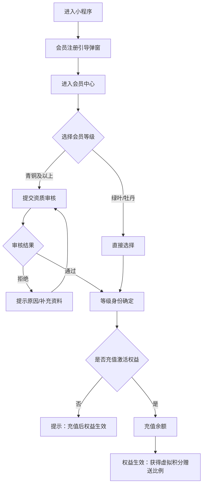
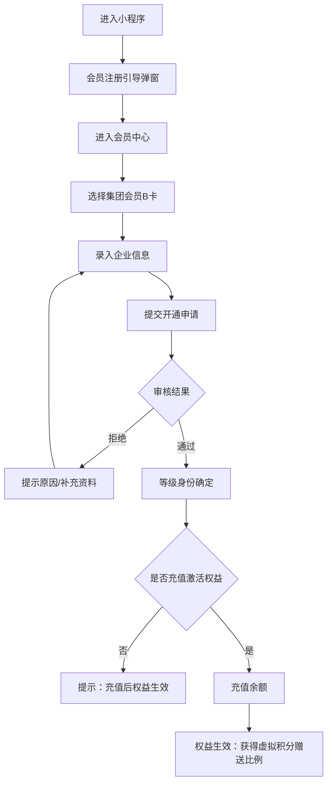
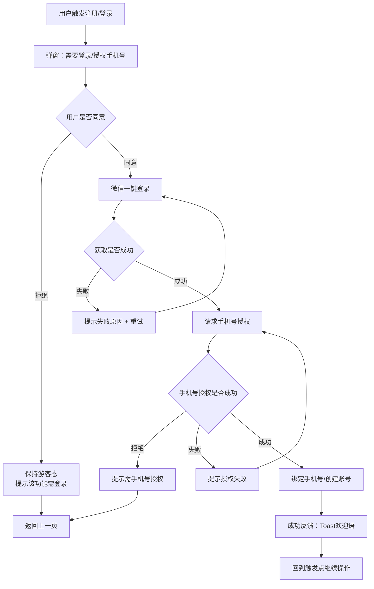
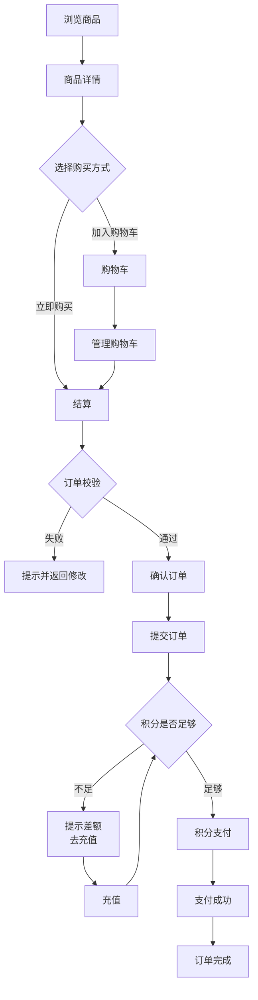
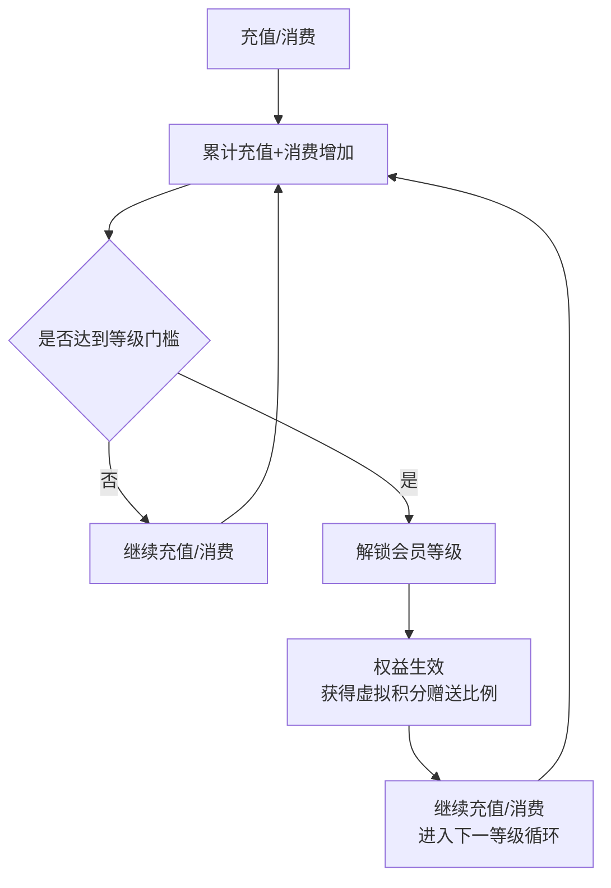
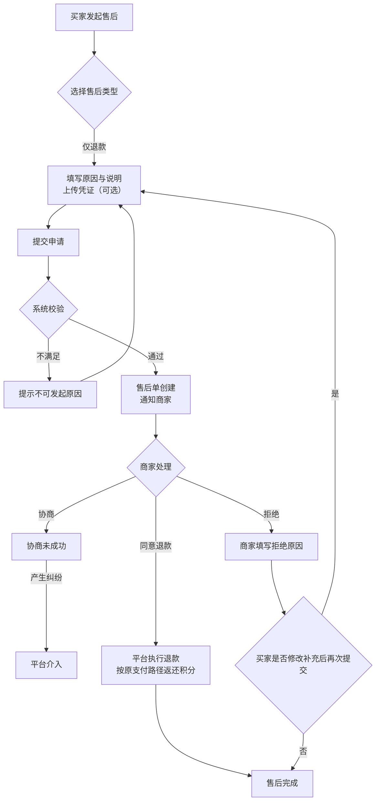
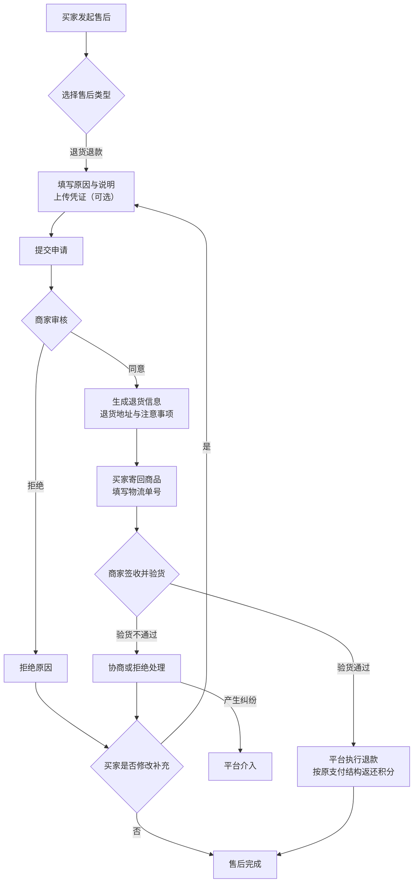
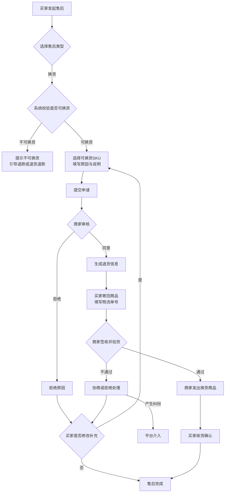

# 商城小程序产品需求文档（V2.0）

> **文档状态**：待评审  
> **版本号**：2.0.0  
> **创建日期**：2026-04-17  
> **最后更新**：2026-04-17

---

# 一、产品概述

## 1.1 产品背景

大健康市场规模持续增长，用户对健康产品的需求日益增加。但现有平台存在几个问题：产品杂乱、真假难辨、品类单一。调研数据显示，15%的用户因"担心买到假货"放弃购买，65%的用户需要跨平台购买不同品类的健康产品。

同时，传统电商模式缺乏长期消费激励机制，用户复购率低，难以形成稳定的用户粘性。

## 1.2 产品定位

健康产品会员制商城小程序，采用"积分预付+会员折扣"模式。用户需先充值获得积分，再使用积分购买商品，不同会员等级享受不同折扣权益。

目标用户为25-45岁、一二线城市、注重健康品质的消费人群。

## 1.3 产品目标

| 目标类型 | 具体目标 | 衡量指标 |
|---------|---------|---------|
| 业务目标 | 建立健康消费平台，提升用户粘性 | 月活用户>5万，复购率>35% |
| 用户目标 | 一站式购买健康产品，获得消费回报 | NPS>70，客单价>150元 |
| 商业目标 | 建立可持续的盈利模式 | 平台毛利率>15% |

## 1.4 MVP范围

| 模块 | 是否包含 | 说明 |
|------|---------|------|
| 用户端购物流程 | ✅ | 首页、分类、商品详情、购物车、订单流程、我的订单、售后申请 |
| 会员中心 | ✅ | 会员注册、等级管理、权益展示、充值、积分管理 |
| 推荐返利系统 | ✅ | 推荐返利、我的收益、提现功能 |
| 商家端 | ✅ | 独立小程序/APP，包含商品管理、订单管理、发货管理 |
| 后台管理系统 | ✅ | 商品管理、订单管理、财务管理、会员管理 |

---

# 二、用户角色

## 2.1 用户角色定义

| 角色 | 描述 | 核心诉求 |
|------|------|---------|
| 普通用户 | 浏览商品、购买商品 | 一站式购买健康产品，获得消费回报 |
| 会员用户 | 享受会员权益 | 获得更多折扣和返利 |
| 商家 | 上架商品、发货 | 精准流量获取、品牌背书、会员数据洞察 |
| 平台运营 | 活动运营、会员管理 | 提升平台活跃度和交易额 |
| 平台客服 | 处理订单、售后 | 高效处理用户问题 |
| 平台财务 | 管理资金、积分 | 确保资金安全和财务合规 |

## 2.2 目标用户画像

### 核心买家画像：健康品质追求者

| 维度 | 描述 |
|------|------|
| 基础属性 | 25-45岁，一二线城市，中高收入 |
| 行为特征 | 月均健康消费≥500元，关注有机认证、成分表，愿为品质支付20-30%溢价 |
| 痛点需求 | 担心假货、希望获得专业健康建议、期望消费有长期回报 |

### 核心商家画像：健康产业链优质供应商

| 维度 | 描述 |
|------|------|
| 基础属性 | 健康食品生产商、有机农场、营养品牌、健康服务机构 |
| 入驻动机 | 精准流量获取、品牌背书、会员数据洞察 |

---

# 三、核心业务模型

## 3.1 积分体系

### 3.1.1 积分定义

积分是平台主要交易货币，分为两种类型：

| 类型 | 定义 | 是否可提现 | 有效期 |
|------|------|-----------|--------|
| 充值积分 | 用户充值获得的积分，1元=1积分 | ✅ 可提现 | 永久有效 |
| 虚拟积分 | 平台赠送的积分，用于消费抵扣 | ❌ 不可提现 | 永久有效 |

**关键规则**：
- 充值积分和虚拟积分不可相互转换
- 两种积分均可用于商品支付
- 支付时按会员等级比例扣减

### 3.1.2 积分来源

| 渠道 | 比例/规则 | 到账时效 | 有效期 | 限制条件 |
|------|----------|---------|--------|---------|
| 充值 | 1元=1充值积分 | 实时 | 永久 | 无限制 |
| 首次充值赠送 | 根据会员等级赠送虚拟积分 | 实时 | 永久 | 限1次 |
| 日常充值赠送 | 根据会员等级赠送充值额的5%-40%虚拟积分 | 实时 | 永久 | 无限制 |
| 消费达标赠送 | 消费达到等级门槛后赠送虚拟积分 | 消费完成 | 永久 | 限1次 |
| 拓展收益（直推） | 好友消费额的4% | 好友首单完成 | 永久 | 无上限 |
| 拓展分享奖（直推） | 好友首次充值总额的1% | 好友完成消费且无售后 | 永久 | 无上限 |
| 协作推荐奖（直推） | 推荐商户订单金额的1% | 订单完成且无售后 | 永久 | 无上限 |
| 间接推荐收益 | 间接推荐好友消费额的2% | 订单完成且无售后 | 永久 | 无上限 |
| 年度评优 | 会员消费后，推荐人获得订单2%收益 | 订单完成且无售后 | 永久 | 按年度活动规则 |
| 平台活动赠送 | 按活动规则 | 按活动规则 | 按活动规则 | 按活动规则 |
| 商家退款返还 | 全额退还支付积分 | 退款审核通过 | 恢复为原有效期 | 退货退款场景 |

### 3.1.3 积分消费规则

**订单应付积分计算**：

```
订单应付总积分 = 商品售卖积分 + 运费 - 优惠折扣
```

**支付扣减规则**：

根据会员等级，按比例扣减充值积分和虚拟积分。

| 会员等级 | 充值积分扣减比例 | 虚拟积分扣减比例 | 说明 |
|---------|----------------|----------------|------|
| 绿叶 | 95% | 5% | 等级越高，虚拟积分占比越高 |
| 牡丹 | 93% | 7% | |
| 青铜 | 90% | 10% | |
| 白银 | 86% | 14% | |
| 黄金 | 82% | 18% | |
| 白金 | 78% | 22% | |
| 钻石 | 74% | 26% | |
| 超钻 | 70% | 30% | |
| 至尊 | 60% | 40% | |

**计算示例**：

```
黄金会员购买100积分商品：
- 充值积分扣减：100 × 82% = 82积分
- 虚拟积分扣减：100 × 18% = 18积分
```

### 3.1.4 积分退款规则

**全额退款**：

按原支付结构返还，示例：

```
订单支付：
- 充值积分：80
- 虚拟积分：20

退款：
- 充值积分：80
- 虚拟积分：20
```

**部分退款**：

按比例返还，示例：

```
订单支付：
- 充值积分：80
- 虚拟积分：20

退款80积分：
- 充值积分：64（80 × 80%）
- 虚拟积分：16（20 × 80%）
```

### 3.1.5 支付拦截

若支付时，充值积分或虚拟积分不足，系统阻断支付。

**提示文案**：积分不足，还差XX积分

**页面展示**：
- 充值积分余额
- 虚拟积分余额
- 【去充值】按钮

---

## 3.2 会员体系

### 3.2.1 会员等级

| 会员等级 | 卡类型 | 累计充值+消费门槛 | 首次充值赠送虚拟积分 | 日常充值赠送比例 |
|---------|-------|------------------|-------------------|----------------|
| 绿叶 | A卡（个人） | 500 积分 | 500 | 充值额 × 5% |
| 牡丹 | A卡（个人） | 2,000 积分 | 5,000 | 充值额 × 7% |
| 青铜 | A卡（个人）/B卡（集团） | 5,000 积分 | 10,000 | 充值额 × 10% |
| 白银 | A卡（个人）/B卡（集团） | 10,000 积分 | 50,000 | 充值额 × 14% |
| 黄金 | A卡（个人）/B卡（集团） | 20,000 积分 | 100,000 | 充值额 × 18% |
| 白金 | A卡（个人）/B卡（集团） | 100,000 积分 | 300,000 | 充值额 × 22% |
| 钻石 | A卡（个人）/B卡（集团） | 150,000 积分 | 500,000 | 充值额 × 26% |
| 超钻 | A卡（个人）/B卡（集团） | 300,000 积分 | 1,000,000 | 充值额 × 30% |
| 至尊 | A卡（个人）/B卡（集团） | 500,000 积分 | 2,000,000 | 充值额 × 40% |

### 3.2.2 会员开通流程

#### 个人会员（A卡）开通流程



#### 集团会员（B卡）开通流程



### 3.2.3 会员等级选择规则

| 规则项 | 说明 |
|-------|------|
| 选择范围 | 用户注册时根据资质选择会员等级 |
| 绿叶/牡丹 | 无需审核，可直接选择 |
| 青铜及以上 | 需提交资质材料，平台审核通过后可选择 |
| 变更规则 | 权益激活前可更改一次，激活后不可更改 |

### 3.2.4 会员权益激活规则

| 规则项 | 说明 |
|-------|------|
| 激活条件 | 充值或消费累计达到所选等级门槛 |
| 激活时机 | 达标后立即激活 |
| 权益内容 | 虚拟积分赠送比例、支付扣减比例等 |

### 3.2.5 会员降级规则

| 规则项 | 说明 |
|-------|------|
| 触发条件 | 用户充值金额低于当前等级的最低充值额 |
| 降级幅度 | 根据充值缺口大小，可能一次降多级 |
| 权益处理 | 降级后立即生效新等级权益 |
| 降级预警 | 充值前提示当前等级最低充值额，避免意外降级 |

**降级示例**：

```
当前等级：黄金（最低充值额20,000积分）
用户充值：5,000积分
结果：降级到青铜（最低充值额5,000积分）
```

### 3.2.6 会员资格审核条件

#### 青铜及以上等级审核条件

| 会员等级 | 审核条件（满足其一即可） |
|---------|----------------------|
| 青铜 | 1. 个人年收入8万元以上（含）<br>2. 经审核特批的会员<br>3. 必须是从事生态健康产业的或认可平台理念<br>4. 没有违法违规行为污点 |
| 白银 | 1. 个人年收入50万元以上（含）<br>2. 企业总资产1000万元以上（含）<br>3. 必须是生态健康领域具有较大贡献的<br>4. 没有违法违规行为污点 |
| 黄金 | 1. 个人年收入100万元以上（含）<br>2. 企业总资产5000万元以上（含）<br>3. 必须是生态健康领域具有影响力的<br>4. 没有违法违规行为污点 |
| 白金 | 1. 个人年收入500万元以上（含）<br>2. 企业总资产1亿元以上（含）<br>3. 必须是生态健康领域具有一定影响力的<br>4. 没有违法违规行为污点 |
| 钻石 | 1. 个人年收入1000万元以上（含）<br>2. 企业总资产10亿元以上（含）<br>3. 必须是生态健康领域具有相当影响力的<br>4. 没有违法违规行为污点 |
| 超钻 | 1. 个人年收入5000万元以上（含）<br>2. 企业总资产100亿元以上（含）<br>3. 必须是生态健康领域具有较大影响力的<br>4. 没有违法违规行为污点 |
| 至尊 | 1. 个人年收入1亿元以上（含）<br>2. 企业总资产500亿元以上（含）<br>3. 必须是生态健康领域具有很大影响力的<br>4. 没有违法违规行为污点 |

**审核材料要求**：

| 会员类型 | 所需材料 |
|---------|---------|
| 个人会员 | 身份证、收入证明/资产证明、从业证明（如适用） |
| 集团会员 | 营业执照、企业资产证明、法人身份证、授权书 |

---

## 3.3 推荐返利体系

### 3.3.1 返利层级

| 层级 | 关系 | 返利类型 | 返利比例 |
|------|------|---------|---------|
| 一级 | 直推好友 | 拓展收益 | 好友消费额的4% |
| 一级 | 直推好友 | 拓展分享奖 | 好友首次充值总额的1% |
| 一级 | 直推商户 | 协作推荐奖 | 订单金额的1% |
| 二级 | 间接推荐好友 | 间接推荐收益 | 好友消费额的2% |

### 3.3.2 返利规则

| 规则项 | 说明 |
|-------|------|
| 返利上限 | 无上限 |
| 返利形式 | 虚拟积分 |
| 到账时效 | 订单完成且无售后 |
| 提现规则 | 虚拟积分不可提现，仅可用于消费 |

### 3.3.3 合规风险提示

⚠️ **重要提示**：当前返利模式（两级返利+无上限+充值模式）存在一定合规风险，建议：

1. **法务审核**：在开发前咨询专业律师，确认是否符合《禁止传销条例》
2. **设置上限**：建议设置单用户月度返利上限（如10,000积分）
3. **层级限制**：严格限制为两级，禁止多级返利
4. **资金池管理**：确保平台有足够的资金池支撑返利
5. **信息披露**：向用户明确披露返利规则和风险

---

# 四、用户核心流程

## 4.1 注册登录流程



### 4.1.1 注册规则

| 规则项 | 说明 |
|-------|------|
| 触发时机 | 首次进入小程序、点击我的功能页面、提交订单、领取优惠、售后等关键动作 |
| 授权方式 | 微信一键登录 + 手机号授权 |
| 流程续接 | 登录/授权完成后，必须回到"触发点"，并自动继续原操作 |
| 防重复 | 同一用户短时间多次触发登录/刷新，仅允许1次请求生效 |

## 4.2 购物流程



### 4.2.1 订单流程规则

| 规则项 | 说明 |
|-------|------|
| 订单超时 | 提交后30分钟未支付，自动取消，释放库存 |
| 库存管理 | 下单时锁定库存，支付成功后扣减库存，订单取消后释放库存 |
| 发货时效 | 商家需在48小时内发货 |
| 自动收货 | 商家发货后7天，用户未确认收货，系统自动确认 |

## 4.3 会员开通流程

详见 [3.2.2 会员开通流程](#322-会员开通流程)

## 4.4 会员升级流程



## 4.5 售后流程

### 4.5.1 售后时效规则

| 规则项 | 说明 |
|-------|------|
| 申请时效 | 订单完成后7天内可申请售后 |
| 商家响应时效 | 商家需在48小时内响应售后申请 |
| 平台介入 | 商家拒绝后，用户可申请平台介入 |

### 4.5.2 仅退款流程



### 4.5.3 退货退款流程



### 4.5.4 换货流程



---

# 五、信息架构

## 5.1 产品架构总览

商城小程序采用模块化架构设计，主要包含以下功能模块：

| 模块 | 子模块 | 说明 |
|------|-------|------|
| 用户端 | 首页、分类、商品详情、购物车、订单流程、我的订单、售后申请、会员中心 | 面向C端用户 |
| 商家端 | 商品管理、订单管理、发货管理、店铺管理 | 独立小程序/APP |
| 后台管理系统 | 商品管理、订单管理、财务管理、会员管理 | 面向平台运营人员 |

---

# 六、功能模块详述

## 6.1 用户端

### 6.1.1 首页

**页面结构**（从上到下）：

| 区域 | 元素 | 说明 |
|------|------|------|
| 自定义导航栏 | 搜索框、小程序胶囊 | 搜索框点击跳转搜索页 |
| 搜索栏 | 搜索图标、扫码icon、消息icon | 支持关键词搜索、扫码、消息入口 |
| 营销Banner | 轮播图（最多5张） | 自动轮播3秒/张，支持手势滑动 |
| 金刚区 | 10个入口（2行×5个） | 分类入口，支持后台配置 |
| 商品推荐区 | 推荐商品列表 | 根据用户画像推荐商品 |
| 会员状态栏 | 积分余额、会员等级 | 快捷入口：充值、会员中心 |

**金刚区入口**：

| 位置 | 名称 | 点击跳转 |
|------|------|---------|
| 1-1 | 干鲜农产品 | 分类页 |
| 1-2 | 健康食品 | 分类页 |
| 1-3 | 健康用品 | 分类页 |
| 1-4 | 健康文化 | 分类页 |
| 1-5 | 医保健康 | 分类页 |
| 2-1 | 生态环境 | 分类页 |
| 2-2 | 绿色科技 | 分类页 |
| 2-3 | 服务项目 | 分类页 |
| 2-4 | 材料设备 | 分类页 |
| 2-5 | 协作单位 | 分类页 |

### 6.1.2 分类页

**页面结构**：

| 区域 | 元素 | 说明 |
|------|------|------|
| 搜索栏 | 搜索框 | 支持关键词搜索 |
| 分类导航 | 一级分类列表 | 左侧垂直导航 |
| 商品列表 | 商品卡片列表 | 右侧展示当前分类商品 |

### 6.1.3 商品详情页

**页面结构**：

| 区域 | 元素 | 说明 |
|------|------|------|
| 商品图片 | 轮播图 | 支持手势滑动 |
| 商品信息 | 名称、积分价格、销量、库存 | 核心商品信息 |
| 会员信息 | 会员折扣、虚拟积分抵扣 | 根据会员等级展示 |
| 商品详情 | 图文详情 | 商品详细介绍 |
| 规格选择 | SKU选择弹窗 | 点击"立即购买"或"加入购物车"弹出 |
| 底部操作栏 | 客服、购物车、加入购物车、立即购买 | 固定底部 |

### 6.1.4 购物车

**页面结构**：

| 区域 | 元素 | 说明 |
|------|------|------|
| 商品列表 | 商品卡片（含选择框、数量调整） | 支持批量选择 |
| 结算栏 | 已选数量、合计积分、结算按钮 | 固定底部 |

**交互规则**：

| 规则项 | 说明 |
|-------|------|
| 商品失效 | 商品下架或库存不足时，显示"失效"状态，不可勾选 |
| 数量调整 | 支持加减按钮和手动输入，上限为库存数量 |
| 全选/取消全选 | 支持全选和取消全选操作 |

### 6.1.5 订单确认页

**页面结构**：

| 区域 | 元素 | 说明 |
|------|------|------|
| 收货地址 | 收货人、电话、地址 | 支持选择/新增地址 |
| 商品列表 | 商品卡片（含图片、名称、规格、数量、积分） | 展示已选商品 |
| 支付信息 | 商品积分、运费、优惠、应付积分 | 积分明细 |
| 积分余额 | 充值积分余额、虚拟积分余额 | 当前可用积分 |
| 提交订单 | 提交订单按钮 | 固定底部 |

### 6.1.6 订单列表页

**页面结构**：

| 区域 | 元素 | 说明 |
|------|------|------|
| 订单状态Tab | 全部、待付款、待发货、待收货、已完成、售后 | Tab切换 |
| 订单卡片 | 订单号、商品信息、订单状态、操作按钮 | 支持取消、支付、确认收货、申请售后 |

### 6.1.7 订单详情页

**页面结构**：

| 区域 | 元素 | 说明 |
|------|------|------|
| 订单状态 | 当前状态、进度条 | 订单流转状态 |
| 收货地址 | 收货人、电话、地址 | 收货信息 |
| 商品列表 | 商品卡片 | 商品详情 |
| 支付信息 | 支付积分明细 | 积分支付详情 |
| 订单信息 | 订单号、下单时间、支付时间等 | 订单基本信息 |
| 操作按钮 | 取消订单、申请售后、确认收货等 | 根据订单状态显示 |

### 6.1.8 会员中心

**页面结构**：

| 区域 | 元素 | 说明 |
|------|------|------|
| 会员信息 | 会员等级、累计充值+消费、权益状态 | 核心会员信息 |
| 积分余额 | 充值积分余额、虚拟积分余额 | 当前可用积分 |
| 会员权益 | 当前等级权益列表 | 权益详情 |
| 充值入口 | 充值按钮 | 跳转充值页 |
| 推荐返利 | 我的收益、推荐好友入口 | 返利系统入口 |
| 会员升级 | 升级进度条、下一等级权益预览 | 升级引导 |

### 6.1.9 充值页

**页面结构**：

| 区域 | 元素 | 说明 |
|------|------|------|
| 积分余额 | 充值积分余额、虚拟积分余额 | 当前可用积分 |
| 充值金额 | 预设金额、自定义金额 | 充值金额选择 |
| 赠送信息 | 根据会员等级显示赠送虚拟积分 | 赠送预览 |
| 支付方式 | 微信支付、银行卡支付 | 支付方式选择 |
| 充值按钮 | 确认充值 | 提交充值 |

### 6.1.10 我的收益页

**页面结构**：

| 区域 | 元素 | 说明 |
|------|------|------|
| 收益概览 | 累计收益、本月收益、可提现收益 | 收益统计 |
| 收益明细 | 收益类型、来源用户、金额、时间 | 收益流水 |
| 推荐入口 | 推荐好友、推荐商户 | 分享入口 |

### 6.1.11 售后申请页

**页面结构**：

| 区域 | 元素 | 说明 |
|------|------|------|
| 售后类型 | 仅退款、退货退款、换货 | 类型选择 |
| 申请原因 | 原因选择、说明填写 | 售后原因 |
| 凭证上传 | 图片上传（可选） | 售后凭证 |
| 提交按钮 | 提交申请 | 提交售后 |

---

## 6.2 商家端

### 6.2.1 商品管理

**功能列表**：

| 功能 | 说明 |
|------|------|
| 商品列表 | 查看所有商品，支持上下架操作 |
| 新增商品 | 填写商品信息、上传图片、设置积分价格、库存 |
| 编辑商品 | 修改商品信息 |
| 库存管理 | 查看库存、调整库存 |

### 6.2.2 订单管理

**功能列表**：

| 功能 | 说明 |
|------|------|
| 订单列表 | 查看所有订单，支持按状态筛选 |
| 订单详情 | 查看订单详情 |
| 发货操作 | 填写物流信息、确认发货 |
| 售后处理 | 处理售后申请 |

### 6.2.3 店铺管理

**功能列表**：

| 功能 | 说明 |
|------|------|
| 店铺信息 | 店铺名称、logo、简介 |
| 资质管理 | 营业执照、经营许可证等 |
| 结算账户 | 银行账户信息 |

---

## 6.3 后台管理系统

### 6.3.1 商品管理

**功能列表**：

| 功能 | 说明 |
|------|------|
| 商品审核 | 审核商家上架的商品 |
| 商品上下架 | 平台可强制上下架商品 |
| 分类管理 | 管理商品分类 |
| 品牌管理 | 管理商品品牌 |

### 6.3.2 订单管理

**功能列表**：

| 功能 | 说明 |
|------|------|
| 订单查询 | 查询所有订单 |
| 售后处理 | 处理平台介入的售后 |
| 订单统计 | 订单数据统计 |

### 6.3.3 会员管理

**功能列表**：

| 功能 | 说明 |
|------|------|
| 会员列表 | 查看所有会员 |
| 会员审核 | 审核青铜及以上等级会员资质 |
| 积分管理 | 查看积分流水、手动调整积分 |
| 等级管理 | 查看会员等级分布 |

### 6.3.4 财务管理

**功能列表**：

| 功能 | 说明 |
|------|------|
| 充值流水 | 查看充值记录 |
| 提现管理 | 审核用户提现申请 |
| 资金统计 | 平台资金统计 |
| 对账管理 | 财务对账 |

---

# 七、非功能需求

## 7.1 性能要求

| 指标 | 要求 |
|------|------|
| 页面加载时间 | <3秒 |
| 接口响应时间 | <500ms |
| 并发用户数 | 支持1万并发用户 |
| 系统可用性 | >99.9% |

## 7.2 安全要求

| 要求 | 说明 |
|------|------|
| 数据加密 | 用户密码、支付信息等敏感数据加密存储 |
| 多重验证 | 用户登录、支付等关键操作需多重验证 |
| 操作日志 | 操作日志记录，支持审计追溯 |
| 隐私合规 | 符合《个人信息保护法》要求，用户数据可导出/删除 |

## 7.3 兼容性要求

| 要求 | 说明 |
|------|------|
| 微信版本 | 支持微信最新版本及前2个大版本 |
| 手机型号 | 支持主流手机型号 |
| 网络环境 | 支持4G/5G/WiFi网络环境 |

## 7.4 数据备份

| 要求 | 说明 |
|------|------|
| 备份频率 | 每日全量备份 |
| 备份保留 | 保留最近30天备份 |
| 恢复时间 | 数据恢复时间<1小时 |

---

# 八、合规建议

## 8.1 返利模式合规风险

当前返利模式（两级返利+无上限+充值模式）存在一定合规风险，建议采取以下措施：

| 建议项 | 说明 |
|-------|------|
| 法务审核 | 在开发前咨询专业律师，确认是否符合《禁止传销条例》 |
| 设置上限 | 建议设置单用户月度返利上限（如10,000积分） |
| 层级限制 | 严格限制为两级，禁止多级返利 |
| 资金池管理 | 确保平台有足够的资金池支撑返利 |
| 信息披露 | 向用户明确披露返利规则和风险 |

## 8.2 资质审核合规

| 建议项 | 说明 |
|-------|------|
| 审核标准 | 制定明确的审核标准，避免主观判断 |
| 审核流程 | 建立标准化的审核流程，确保公平公正 |
| 审核记录 | 保留审核记录，支持追溯 |

## 8.3 数据安全合规

| 建议项 | 说明 |
|-------|------|
| 隐私政策 | 制定完善的隐私政策，明确告知用户数据使用方式 |
| 数据导出 | 支持用户导出个人数据 |
| 数据删除 | 支持用户删除个人数据 |
| 数据跨境 | 如有数据跨境需求，需符合相关法规 |

---

# 九、待确认事项

| 序号 | 事项 | 状态 | 备注 |
|------|------|------|------|
| 1 | 返利模式是否需要设置上限 | 待确认 | 建议设置上限以控制风险 |
| 2 | 资质审核的具体材料要求 | 待确认 | 需与运营团队确认 |
| 3 | 银行卡充值的到账时效 | 待确认 | 需与技术团队确认 |
| 4 | 商家端是否需要独立APP | 待确认 | 当前规划为独立小程序/APP |
| 5 | 会员降级的具体阈值 | 待确认 | 需与运营团队确认 |

---

# 十、版本规划

## 10.1 MVP版本（V1.0）

| 模块 | 功能 |
|------|------|
| 用户端 | 注册登录、首页、分类、商品详情、购物车、订单流程、会员中心、充值 |
| 商家端 | 商品管理、订单管理 |
| 后台管理系统 | 商品审核、订单查询、会员审核 |

## 10.2 后续迭代

| 版本 | 功能 |
|------|------|
| V1.1 | 推荐返利系统、我的收益 |
| V1.2 | 售后流程、平台介入 |
| V1.3 | 营销活动（优惠券、秒杀等） |
| V2.0 | 数据分析、会员画像 |

---

# 附录

## A. 名词解释

| 名词 | 解释 |
|------|------|
| 充值积分 | 用户充值获得的积分，可提现 |
| 虚拟积分 | 平台赠送的积分，用于消费抵扣，不可提现 |
| 直推 | 直接推荐的好友 |
| 间接推荐 | 直推好友推荐的好友 |

## B. 参考文档

- 《禁止传销条例》
- 《个人信息保护法》
- 《网络安全法》
- 微信小程序开发文档

---

**文档结束**
