# 商城小程序产品需求文档（V3.1）

> **文档状态**：待评审  
> **版本号**：3.1.0  
> **创建日期**：2026-05-07  
> **最后更新**：2026-05-28  
> **变更说明**：基于V3.0评审讨论结果优化

---

# 一、产品概述

## 1.1 产品背景

大健康市场规模持续增长，用户对健康产品的需求日益增加。但现有平台存在几个问题：产品杂乱、真假难辨、品类单一。调研数据显示，**15%的用户因"担心买到假货"放弃购买**，**65%的用户需要跨平台购买不同品类的健康产品**。

同时，传统电商模式缺乏长期消费激励机制，用户复购率低，难以形成稳定的用户粘性。

## 1.2 产品定位

**健康产品会员制商城小程序**，采用"积分预付+会员折扣"模式。用户需先充值获得积分，再使用积分购买商品，不同会员等级享受不同折扣权益。

**核心价值主张**：让健康消费更安心、更实惠、更有价值回报

## 1.3 目标用户

| 维度 | 描述 |
|------|------|
| 年龄 | 25-45岁 |
| 地域 | 一二线城市为主 |
| 收入 | 中高收入群体（月均健康消费≥500元） |
| 特征 | 关注有机认证、成分表，愿为品质支付20-30%溢价 |
| 痛点 | 担心假货、希望获得专业健康建议、期望消费有长期回报 |

## 1.4 产品目标

| 目标类型 | 具体目标 | 衡量指标 | 时间窗口 |
|---------|---------|---------|---------|
| 业务目标 | 建立健康消费平台，提升用户粘性 | 月活用户>5万，复购率>35% | 6个月 |
| 用户目标 | 一站式购买健康产品，获得消费回报 | NPS>70，客单价>150元 | 6个月 |
| 商业目标 | 建立可持续的盈利模式 | 平台毛利率>15% | 12个月 |

## 1.5 MVP范围

| 模块 | 是否包含 | 说明 |
|------|---------|------|
| 用户端购物流程 | ✅ | 首页、分类、商品详情、购物车、订单流程、我的订单、售后申请 |
| 会员中心 | ✅ | 会员注册、等级管理、权益展示、充值、积分管理 |
| 推荐返利系统 | ✅ | 推荐返利、我的收益、提现功能 |
| 商家端 | ✅ | 独立小程序/APP，包含商品管理、订单管理、发货管理 |
| 后台管理系统 | ✅ | 商品管理、订单管理、财务管理、会员管理 |

---

# 二、用户角色

## 2.1 用户角色定义

| 角色 | 描述 | 核心诉求 |
|------|------|---------|
| 普通用户 | 浏览商品、购买商品 | 一站式购买健康产品，获得消费回报 |
| 会员用户 | 享受会员权益 | 获得更多折扣和返利 |
| 商家 | 上架商品、发货 | 精准流量获取、品牌背书、会员数据洞察 |
| 平台运营 | 活动运营、会员管理 | 提升平台活跃度和交易额 |
| 平台客服 | 处理订单、售后 | 高效处理用户问题 |
| 平台财务 | 管理资金、积分 | 确保资金安全和财务合规 |

## 2.2 目标用户画像

### 核心买家画像：健康品质追求者

| 维度 | 描述 |
|------|------|
| 基础属性 | 25-45岁，一二线城市，中高收入 |
| 行为特征 | 月均健康消费≥500元，关注有机认证、成分表，愿为品质支付20-30%溢价 |
| 痛点需求 | 担心假货、希望获得专业健康建议、期望消费有长期回报 |

### 核心商家画像：健康产业链优质供应商

| 维度 | 描述 |
|------|------|
| 基础属性 | 健康食品生产商、有机农场、营养品牌、健康服务机构 |
| 入驻动机 | 精准流量获取、品牌背书、会员数据洞察 |

---

# 三、核心业务模型

## 3.1 积分体系

### 3.1.1 积分定义

积分是平台主要交易货币，分为两种类型：

| 类型 | 定义 | 是否可提现 | 有效期 |
|------|------|-----------|--------|
| 充值积分 | 用户充值获得的积分，1元=1积分 | ✅ 可提现 | 永久有效 |
| 虚拟积分 | 平台赠送的积分，用于消费抵扣 | ❌ 不可提现 | 永久有效 |

**关键规则**：
- 充值积分和虚拟积分不可相互转换
- 两种积分均可用于商品支付
- 支付时按会员等级比例扣减（详见3.1.3）

### 3.1.2 积分来源

| 渠道 | 比例/规则 | 到账时效 | 有效期 | 限制条件 |
|------|----------|---------|--------|---------|
| 充值 | 1元=1充值积分 | 实时 | 永久 | 无限制 |
| 注册赠送 | 新用户注册赠送100虚拟积分 | 注册完成 | 30天 | 限1次 |
| 首单奖励 | 完成首单额外赠送200虚拟积分 | 订单完成 | 永久 | 限1次 |
| 日常充值赠送 | 根据会员等级赠送充值额的5%-25%虚拟积分 | 实时 | 永久 | 无限制 |
| 消费达标赠送 | 消费达到等级门槛后赠送虚拟积分 | 消费完成 | 永久 | 限1次 |
| 拓展收益（直推）⚠️ | 好友消费额的4% | 好友首单完成 | 永久 | 无上限 |
| 拓展分享奖（直推）⚠️ | 好友首次充值总额的1% | 好友完成消费且无售后 | 永久 | 无上限 |
| 协作推荐奖（直推） | 推荐商户订单金额的1% | 订单完成且无售后 | 永久 | 无上限 |
| 间接推荐收益⚠️ | 间接推荐好友消费额的2% | 订单完成且无售后 | 永久 | 无上限 |
| 年度评优 | 会员消费后，推荐人获得订单2%收益 | 订单完成且无售后 | 永久 | 按年度活动规则 |
| 平台活动赠送 | 按活动规则 | 按活动规则 | 按活动规则 | 按活动规则 |
| 商家退款返还 | 全额退还支付积分 | 退款审核通过 | 恢复为原有效期 | 退货退款场景 |

> ⚠️ **合规风险提示**：
> - "拓展收益"建议更名为"消费奖励"
> - "拓展分享奖"建议更名为"分享奖励"
> - "间接推荐收益"建议更名为"间推奖励"
> - 以上命名需经法务审核确认

### 3.1.3 积分支付扣减规则（优化版）

**支付扣减优先级逻辑**：

```
┌─────────────────────────────────────────────────────────────┐
│                    积分支付扣减规则                          │
├─────────────────────────────────────────────────────────────┤
│ 场景1：虚拟积分充足 && 充值积分充足                           │
│       → 按会员等级比例扣减                                   │
│                                                             │
│ 场景2：虚拟积分不足 && 充值积分 ≥ 订单金额                    │
│       → 允许用充值积分全额支付                               │
│                                                             │
│ 场景3：充值积分 < 订单金额                                    │
│       → 阻断支付，提示"充值积分不足，还差XX积分"              │
└─────────────────────────────────────────────────────────────┘
```

**按比例扣减规则**：

| 会员等级 | 充值积分扣减比例 | 虚拟积分扣减比例 | 说明 |
|---------|----------------|----------------|------|
| 绿叶 | 95% | 5% | 基础扣减比例 |
| 牡丹 | 92% | 8% | 等级越高，虚拟积分占比越高 |
| 青铜 | 88% | 12% | 每升一级增加3%-4%虚拟积分比例 |
| 白银 | 84% | 16% | |
| 黄金 | 80% | 20% | |
| 钻石 | 75% | 25% | 最高虚拟积分比例 |

**计算示例**：

```
示例1：黄金会员购买100积分商品（虚拟积分充足）
- 充值积分扣减：100 × 80% = 80积分
- 虚拟积分扣减：100 × 20% = 20积分

示例2：黄金会员购买100积分商品（虚拟积分仅10，充值积分100）
- 虚拟积分不足（需要20，实际10）
- 充值积分充足（100 ≥ 100）
- 结果：允许用充值积分全额支付100积分

示例3：黄金会员购买100积分商品（充值积分仅50）
- 充值积分不足（50 < 100）
- 结果：阻断支付，提示"充值积分不足，还差50积分"
```

### 3.1.4 积分退款规则

**全额退款**：按原支付结构返还

**部分退款**：按比例返还

**退款示例**：

```
场景：黄金会员购买100积分商品，申请退款80积分
原支付：充值积分80 + 虚拟积分20
退款计算：
- 充值积分返还：80 × 80% = 64积分
- 虚拟积分返还：20 × 80% = 16积分
合计返还：80积分（充值64 + 虚拟16）
```

### 3.1.5 支付拦截与提示

| 场景 | 处理方式 | 页面展示 |
|------|---------|---------|
| 充值积分+虚拟积分≥订单金额 | 正常支付，不阻断 | - |
| 虚拟积分不足，充值积分≥订单金额 | 使用充值积分全额支付，不阻断 | - |
| 充值积分<订单金额 | 阻断支付 | 充值积分余额、虚拟积分余额、【去充值】按钮 |

**提示文案**：充值积分不足，还差XX积分

---

## 3.2 会员体系

### 3.2.1 会员等级

| 会员等级 | 卡类型 | 累计充值+消费门槛（积分） | 首次充值赠送虚拟积分 | 日常充值赠送比例 | 虚拟积分抵扣比例 |
|---------|-------|------------------------|-------------------|----------------|----------------|
| 绿叶 | A卡（个人） | 500 | 500 | 充值额 × 5% | 5% |
| 牡丹 | A卡（个人） | 2,000 | 2,000 | 充值额 × 8% | 8% |
| 青铜 | A卡（个人）/B卡（集团） | 10,000 | 10,000 | 充值额 × 12% | 12% |
| 白银 | A卡（个人）/B卡（集团） | 30,000 | 30,000 | 充值额 × 16% | 16% |
| 黄金 | A卡（个人）/B卡（集团） | 80,000 | 80,000 | 充值额 × 20% | 20% |
| 钻石 | A卡（个人）/B卡（集团） | 200,000 | 200,000 | 充值额 × 25% | 25% |

### 3.2.2 会员等级核心规则（优化版）

> **重要变更**：取消降级规则，会员等级永久保持

| 规则项 | 说明 |
|-------|------|
| 等级永久性 | 用户选择并激活会员等级后，等级永久保持，不再变更 |
| 累计充值+消费作用 | 仅用于最低等级（绿叶）会员权益的开通判断，开通后仅作为记录 |
| 绿叶/牡丹开通 | 无需审核，可直接选择 |
| 青铜及以上开通 | 需提交资质材料，平台审核通过后可选择 |
| 等级变更 | 权益激活前可更改一次，激活后不可更改 |

### 3.2.3 会员开通流程

#### 个人会员（A卡）开通流程

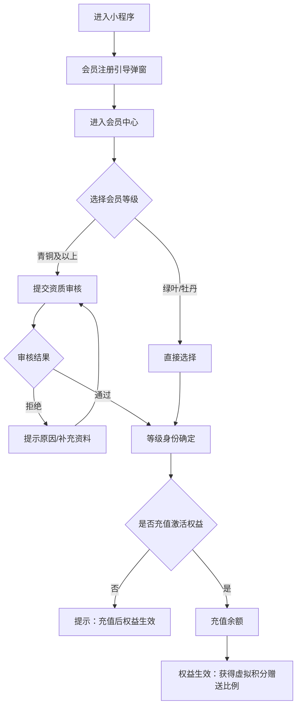

#### 集团会员（B卡）开通流程

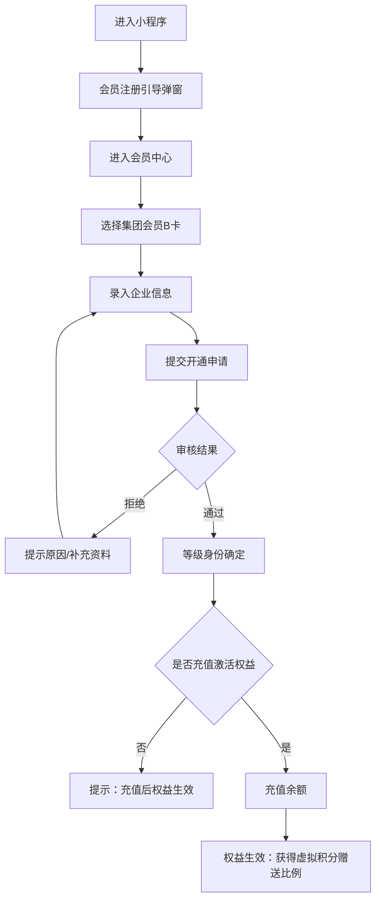

### 3.2.4 会员权益激活规则

| 规则项 | 说明 |
|-------|------|
| 激活条件 | 充值或消费累计达到所选等级门槛 |
| 激活时机 | 达标后立即激活 |
| 权益内容 | 虚拟积分赠送比例、支付扣减比例等 |

### 3.2.5 会员资格审核条件

| 会员等级 | 审核条件（满足其一即可） |
|---------|----------------------|
| 青铜 | 1. 个人年收入8万元以上（含）<br>2. 经审核特批的会员<br>3. 从事生态健康产业或认可平台理念<br>4. 无违法违规行为污点 |
| 白银 | 1. 个人年收入50万元以上（含）<br>2. 企业总资产1000万元以上（含）<br>3. 生态健康领域具有较大贡献<br>4. 无违法违规行为污点 |
| 黄金 | 1. 个人年收入100万元以上（含）<br>2. 企业总资产5000万元以上（含）<br>3. 生态健康领域具有影响力<br>4. 无违法违规行为污点 |
| 钻石 | 1. 个人年收入500万元以上（含）<br>2. 企业总资产5亿元以上（含）<br>3. 生态健康领域具有重要影响力<br>4. 无违法违规行为污点 |

**审核材料要求**：

| 会员类型 | 所需材料 |
|---------|---------|
| 个人会员 | 身份证、收入证明/资产证明、从业证明（如适用） |
| 集团会员 | 营业执照、企业资产证明、法人身份证、授权书 |

---

## 3.3 推荐返利体系

### 3.3.1 返利层级

| 层级 | 关系 | 返利类型 | 返利比例 |
|------|------|---------|---------|
| 一级 | 直推好友 | 拓展收益⚠️ | 好友消费额的4% |
| 一级 | 直推好友 | 拓展分享奖⚠️ | 好友首次充值总额的1% |
| 一级 | 直推商户 | 协作推荐奖 | 订单金额的1% |
| 二级 | 间接推荐好友 | 间接推荐收益⚠️ | 好友消费额的2% |

> ⚠️ **合规风险提示**：建议将"拓展收益"更名为"消费奖励"，"拓展分享奖"更名为"分享奖励"，"间接推荐收益"更名为"间推奖励"，需经法务审核确认。

### 3.3.2 返利风控规则

| 规则项 | 限制内容 | 说明 |
|-------|---------|------|
| 月度返利上限 | 单个用户每月≤10,000积分 | 防止过度返利 |
| 层级限制 | 严格两级返利 | 避免传销嫌疑 |
| 提现限制 | 虚拟积分不可提现 | 仅可消费抵扣 |
| 资金储备 | 预留≥3个月返利资金 | 确保履约能力 |

### 3.3.3 返利规则

| 规则项 | 说明 |
|-------|------|
| 返利上限 | 单个用户月度返利上限10,000积分 |
| 超额处理 | 超过上限部分不发放，不累积至下月 |
| 返利形式 | 虚拟积分 |
| 到账时效 | 订单完成且无售后 |
| 提现规则 | 虚拟积分不可提现，仅可用于消费 |

---

# 四、用户核心流程

## 4.1 注册登录流程

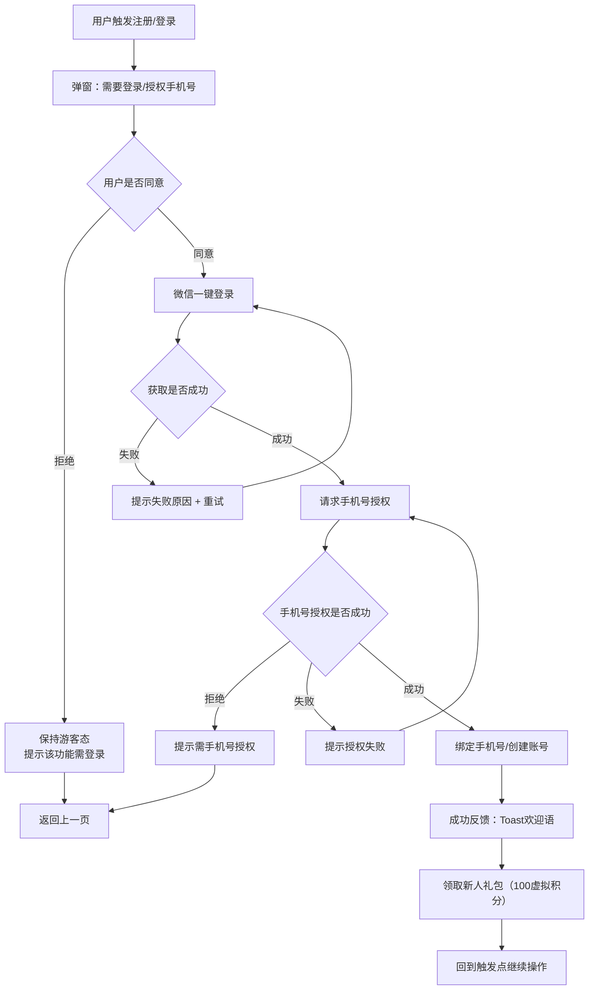

### 4.1.1 注册规则

| 规则项 | 说明 |
|-------|------|
| 触发时机 | 首次进入小程序、点击我的功能页面、提交订单、领取优惠、售后等关键动作 |
| 授权方式 | 微信一键登录 + 手机号授权 |
| 流程续接 | 登录/授权完成后，必须回到"触发点"，并自动继续原操作 |
| 防重复 | 同一用户短时间多次触发登录/刷新，仅允许1次请求生效 |

### 4.1.2 新用户引导流程

| 步骤 | 触发时机 | 内容 | 目的 |
|-----|---------|------|------|
| 1 | 注册完成 | 自动领取100虚拟积分 | 降低首单门槛 |
| 2 | 进入首页 | 弹窗展示会员权益 | 价值感知 |
| 3 | 完成首单 | 额外赠送200虚拟积分 | 激励首单 |
| 4 | 进入会员中心 | 展示"本月已节省XX积分" | 强化价值感知 |

**新用户引导文案**：

| 场景 | 文案 |
|------|------|
| 注册成功Toast | 欢迎加入！已为您发放100积分新人礼包 |
| 首页权益弹窗标题 | 开通会员，享专属折扣 |
| 首页权益弹窗内容 | 充值即享会员折扣，消费越多省越多 |
| 首单完成Toast | 恭喜完成首单！额外赠送200积分 |
| 会员中心节省提示 | 本月已节省 {金额}积分，相当于省下 {金额}元 |

## 4.2 购物流程

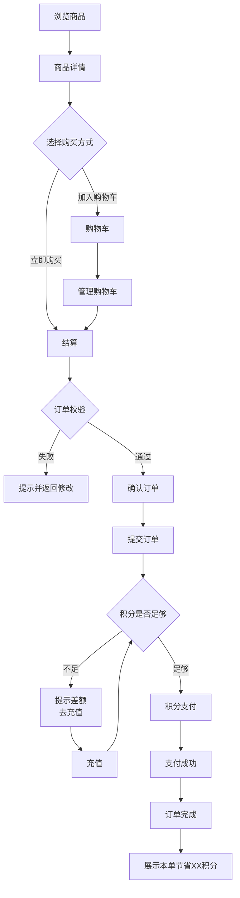

### 4.2.1 订单流程规则

| 规则项 | 说明 |
|-------|------|
| 订单超时 | 提交后30分钟未支付，自动取消，释放库存 |
| 库存管理 | 下单时锁定库存，支付成功后扣减库存，订单取消后释放库存 |
| 发货时效 | 商家需在48小时内发货 |
| 自动收货 | 商家发货后7天，用户未确认收货，系统自动确认 |

### 4.2.2 订单状态机

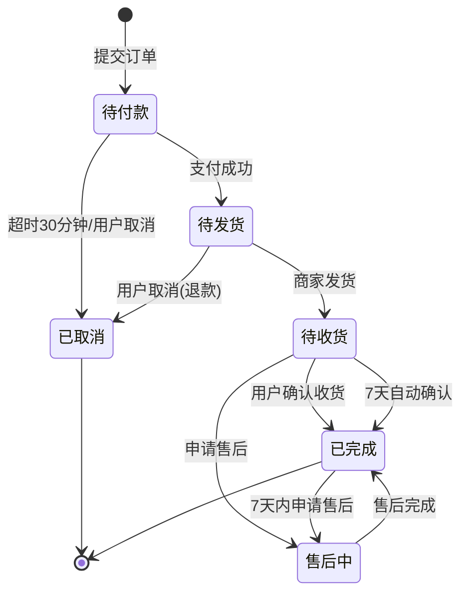

**订单状态定义**：

| 状态 | 说明 | 可操作 |
|------|------|--------|
| 待付款 | 订单已提交，等待支付 | 取消订单、去支付 |
| 待发货 | 已支付，等待商家发货 | 申请退款 |
| 待收货 | 商家已发货，等待收货 | 确认收货、查看物流、申请售后 |
| 已完成 | 订单已完成 | 申请售后、再次购买 |
| 售后中 | 售后申请处理中 | 查看售后进度 |
| 已取消 | 订单已取消 | 再次购买 |

## 4.3 会员升级流程

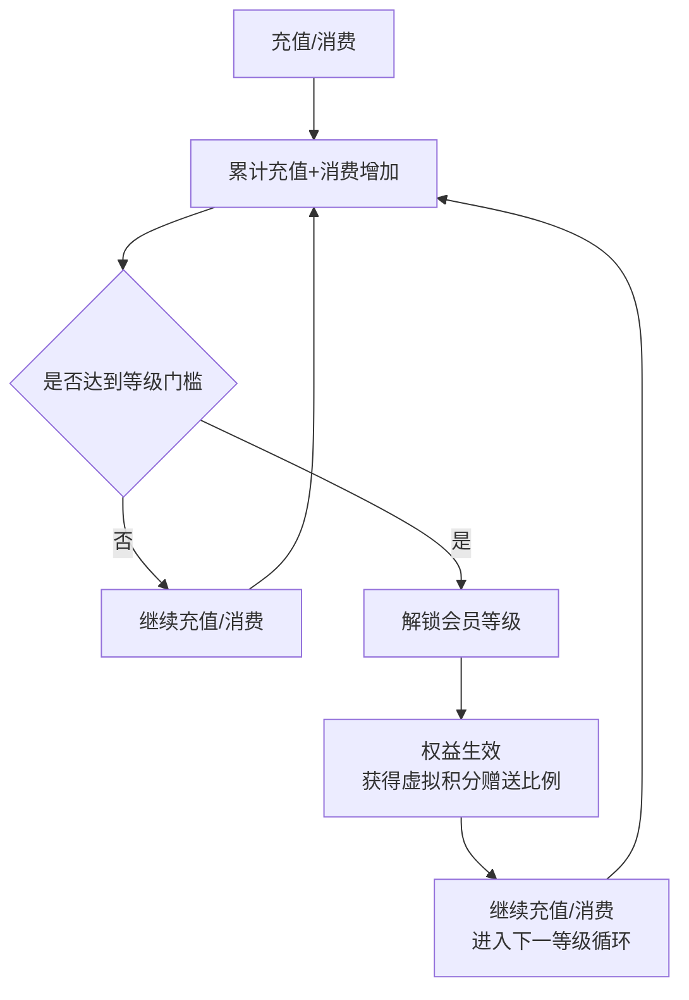

## 4.4 售后流程

### 4.4.1 售后时效规则

| 规则项 | 说明 |
|-------|------|
| 申请时效 | 订单完成后7天内可申请售后 |
| 商家响应时效 | 商家需在24小时内响应售后申请 |
| 平台介入 | 商家拒绝后，用户可申请平台介入，平台需在48小时内处理 |
| 退货物流填写 | 用户需在7天内填写退货物流单号 |

### 4.4.2 仅退款流程

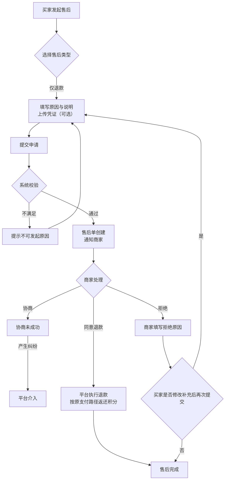

### 4.4.3 退货退款流程

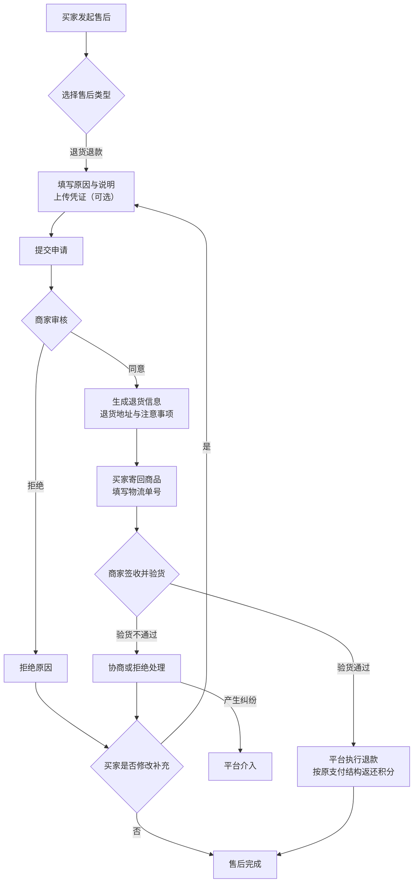

### 4.4.4 换货流程

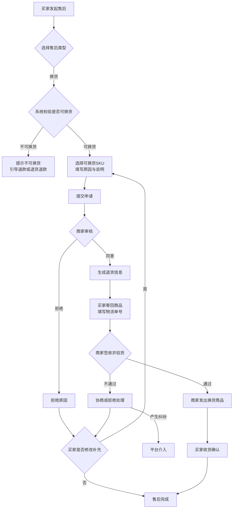

---

# 五、信息架构

## 5.1 产品功能结构图（总览）

**图表说明**：

商城小程序采用模块化架构设计，包含三大核心模块：

- **用户端**：面向C端消费者，提供完整的购物流程，包括首页浏览、商品分类、商品详情、购物车管理、订单流程、会员中心、售后申请和消息中心共8个核心页面。
- **商家端**：与用户端在同一小程序中，通过不同入口进入。支持商家进行商品管理、订单管理、发货管理、店铺管理和数据看板。
- **后台管理系统**：面向平台运营人员，提供商品审核、订单管理、会员管理、财务管理和风控管理功能。

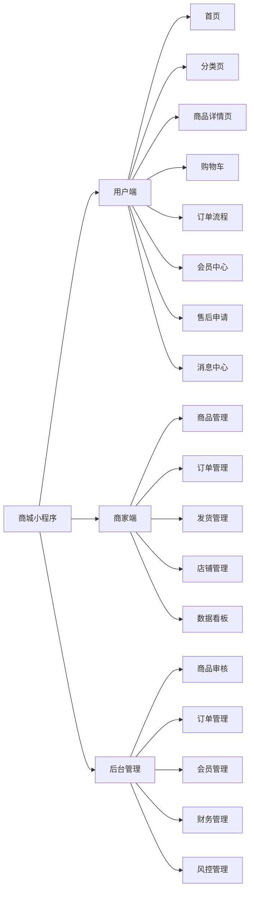

## 5.2 用户端功能结构图（详细）

**图表说明**：

用户端共包含8个核心页面：

- **首页**：提供搜索、Banner轮播、金刚区入口、商品推荐和会员状态栏。
- **分类页**：支持分类导航、商品列表和筛选条件。
- **商品详情页**：展示商品图片、信息、会员信息、规格选择和底部操作栏。
- **购物车**：支持商品列表管理、数量调整、全选/取消、批量删除和结算。
- **订单流程**：包含订单确认、地址管理、订单列表和订单详情。
- **会员中心**：展示会员信息、积分余额、会员权益、充值入口、我的收益和升级进度。
- **售后申请**：支持售后类型选择、原因填写和凭证上传。
- **消息中心**：分类展示订单消息、系统消息和活动消息。

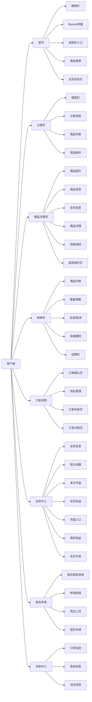

## 5.3 首页功能结构图

**图表说明**：

首页作为用户进入小程序的第一个页面，包含5个核心区域：

- **搜索栏**：提供搜索图标、扫码入口和消息入口。
- **促销Banner**：支持最多5张轮播图自动轮播（3秒/张），支持手势滑动。
- **金刚区入口**：包含10个分类入口（2行×5个），分别是干鲜农产品、健康食品、健康用品、健康文化、医保健康、生态环境、绿色科技、服务项目、材料设备、协作单位。
- **商品推荐区**：根据用户画像推荐商品列表。
- **会员状态栏**：展示积分余额、会员等级、本月节省，并提供充值入口。

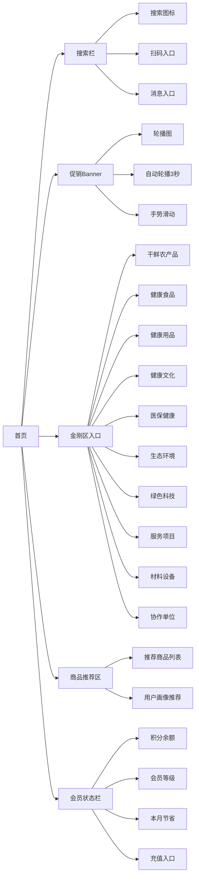

## 5.4 会员中心功能结构图

**图表说明**：

会员中心是用户管理会员权益的核心页面，包含7个功能模块：

- **会员信息**：展示会员等级、累计充值+消费金额和权益状态。
- **积分余额**：分别展示充值积分余额和虚拟积分余额。
- **本月节省**：展示本月累计节省的积分和对应金额，强化用户价值感知。
- **会员权益**：展示当前等级权益、虚拟积分赠送比例和支付扣减比例。
- **充值入口**：跳转至充值页。
- **推荐返利**：包含我的收益、推荐好友和推荐商户三个入口。
- **会员升级**：展示升级进度条和下一等级权益预览。

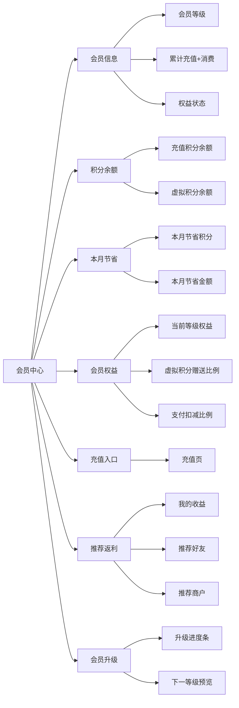

## 5.5 底部导航栏（TabBar）

**图表说明**：

TabBar固定在页面底部，包含4个导航入口：

- **首页**：使用home图标，点击跳转首页。
- **分类**：使用category图标，点击跳转分类页。
- **购物车**：使用cart图标，右上角显示数量角标，点击跳转购物车页面。
- **我的**：使用user图标，点击跳转个人中心页面。

TabBar贯穿用户端所有页面，为用户提供便捷的一级导航。

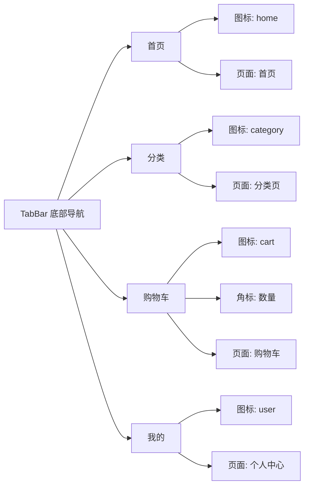

---

# 六、功能模块详述

## 6.1 用户端

### 6.1.1 首页

**页面结构**（从上到下）：

| 区域 | 元素 | 说明 |
|------|------|------|
| 自定义导航栏 | 搜索框、小程序胶囊 | 搜索框点击跳转搜索页 |
| 搜索栏 | 搜索图标、扫码icon、消息icon | 支持关键词搜索、扫码、消息入口 |
| 营销Banner | 轮播图（最多5张） | 自动轮播3秒/张，支持手势滑动 |
| 金刚区 | 10个入口（2行×5个） | 分类入口，支持后台配置 |
| 商品推荐区 | 推荐商品列表 | 根据用户画像推荐商品 |
| 会员状态栏 | 积分余额、会员等级、本月节省 | 快捷入口：充值、会员中心 |

**金刚区入口**：

| 位置 | 名称 | 点击跳转 |
|------|------|---------|
| 1-1 | 干鲜农产品 | 分类页 |
| 1-2 | 健康食品 | 分类页 |
| 1-3 | 健康用品 | 分类页 |
| 1-4 | 健康文化 | 分类页 |
| 1-5 | 医保健康 | 分类页 |
| 2-1 | 生态环境 | 分类页 |
| 2-2 | 绿色科技 | 分类页 |
| 2-3 | 服务项目 | 分类页 |
| 2-4 | 材料设备 | 分类页 |
| 2-5 | 协作单位 | 分类页 |

### 6.1.2 搜索页

**页面结构**：

| 区域 | 元素 | 说明 |
|------|------|------|
| 搜索栏 | 搜索框、取消按钮 | 支持关键词搜索 |
| 历史搜索 | 最近搜索关键词列表 | 支持清空历史 |
| 热门搜索 | 热门关键词列表 | 后台配置 |
| 搜索结果 | 商品卡片列表 | 按相关度/销量排序 |

**交互规则**：

| 规则项 | 说明 |
|-------|------|
| 搜索触发 | 点击键盘搜索按钮或点击历史/热门关键词 |
| 结果展示 | 显示商品图片、名称、积分价格、销量 |
| 空结果 | 显示"暂无搜索结果"提示 |

**排序规则**：

| 排序方式 | 权重说明 |
|---------|---------|
| 综合排序（默认） | 相关度权重60% + 销量权重30% + 上架时间权重10% |
| 销量优先 | 按销量降序 |
| 价格升序 | 按积分价格升序 |
| 价格降序 | 按积分价格降序 |
| 新品优先 | 按上架时间降序 |

### 6.1.3 分类页

**页面结构**：

| 区域 | 元素 | 说明 |
|------|------|------|
| 搜索栏 | 搜索框 | 支持关键词搜索 |
| 分类导航 | 一级分类列表 | 左侧垂直导航 |
| 商品列表 | 商品卡片列表 | 右侧展示当前分类商品 |

**筛选条件**：

| 筛选项 | 说明 |
|-------|------|
| 价格区间 | 自定义最低积分-最高积分 |
| 销量 | 销量>100、销量>500、销量>1000 |
| 上架时间 | 近7天、近30天、近90天 |
| 会员折扣 | 仅看有会员折扣商品 |

### 6.1.4 商品详情页

**页面结构**：

| 区域 | 元素 | 说明 |
|------|------|------|
| 商品图片 | 轮播图 | 支持手势滑动 |
| 商品信息 | 名称、积分价格、销量、库存 | 核心商品信息 |
| 会员信息 | 会员折扣、虚拟积分抵扣 | 根据会员等级展示 |
| 商品详情 | 图文详情 | 商品详细介绍 |
| 规格选择 | SKU选择弹窗 | 点击"立即购买"或"加入购物车"弹出 |
| 底部操作栏 | 客服、购物车、加入购物车、立即购买 | 固定底部 |

### 6.1.5 消息中心

**页面结构**：

| 区域 | 元素 | 说明 |
|------|------|------|
| 消息分类 | 全部、订单消息、系统消息、活动消息 | Tab切换 |
| 消息列表 | 消息标题、时间、已读/未读状态 | 支持点击查看详情 |
| 消息详情 | 消息内容、相关订单/商品链接 | 跳转相关页面 |

**消息类型**：

| 类型 | 说明 | 是否推送 |
|------|------|---------|
| 订单消息 | 订单状态变更通知（发货、收货、退款等） | 是 |
| 系统消息 | 平台公告、会员等级变更通知 | 是 |
| 活动消息 | 促销活动、优惠券到账通知 | 是 |

### 6.1.6 购物车

**页面结构**：

| 区域 | 元素 | 说明 |
|------|------|------|
| 商品列表 | 商品卡片（含选择框、数量调整） | 支持批量选择 |
| 结算栏 | 已选数量、合计积分、结算按钮 | 固定底部 |

**交互规则**：

| 规则项 | 说明 |
|-------|------|
| 商品失效 | 商品下架或库存不足时，显示"失效"状态，不可勾选 |
| 数量调整 | 支持加减按钮和手动输入，上限为库存数量 |
| 全选/取消全选 | 支持全选和取消全选操作 |
| 批量删除 | 支持批量删除商品 |
| 移入收藏 | 支持将商品移入收藏夹（如有收藏功能） |

### 6.1.7 订单确认页

**页面结构**：

| 区域 | 元素 | 说明 |
|------|------|------|
| 收货地址 | 收货人、电话、地址 | 支持选择/新增地址 |
| 商品列表 | 商品卡片（含图片、名称、规格、数量、积分） | 展示已选商品 |
| 支付信息 | 商品积分、运费、优惠、应付积分 | 积分明细 |
| 积分余额 | 充值积分余额、虚拟积分余额 | 当前可用积分 |
| 提交订单 | 提交订单按钮 | 固定底部 |

### 6.1.8 地址管理

**页面结构**：

| 区域 | 元素 | 说明 |
|------|------|------|
| 地址列表 | 收货人、电话、地址、默认标签 | 支持编辑、删除、设为默认 |
| 新增地址 | 新增按钮 | 跳转新增/编辑地址页 |

**地址表单**：

| 字段 | 说明 |
|------|------|
| 收货人 | 姓名，必填 |
| 手机号 | 11位手机号，必填 |
| 所在地区 | 省/市/区，必填 |
| 详细地址 | 街道/门牌号，必填 |
| 设为默认 | 开关，可选 |

**交互规则**：

| 规则项 | 说明 |
|-------|------|
| 地址上限 | 最多保存20个地址 |
| 默认地址 | 仅可设置1个默认地址 |
| 删除确认 | 删除前需二次确认 |

### 6.1.9 订单列表页

**页面结构**：

| 区域 | 元素 | 说明 |
|------|------|------|
| 订单状态Tab | 全部、待付款、待发货、待收货、已完成、售后 | Tab切换 |
| 订单卡片 | 订单号、商品信息、订单状态、操作按钮 | 支持取消、支付、确认收货、申请售后 |

### 6.1.10 订单详情页

**页面结构**：

| 区域 | 元素 | 说明 |
|------|------|------|
| 订单状态 | 当前状态、进度条 | 订单流转状态 |
| 收货地址 | 收货人、电话、地址 | 收货信息 |
| 商品列表 | 商品卡片 | 商品详情 |
| 支付信息 | 支付积分明细 | 积分支付详情 |
| 订单信息 | 订单号、下单时间、支付时间等 | 订单基本信息 |
| 操作按钮 | 取消订单、申请售后、确认收货等 | 根据订单状态显示 |

### 6.1.11 会员中心

**页面结构**：

| 区域 | 元素 | 说明 |
|------|------|------|
| 会员信息 | 会员等级、累计充值+消费、权益状态 | 核心会员信息 |
| 积分余额 | 充值积分余额、虚拟积分余额 | 当前可用积分 |
| 本月节省 | 本月累计节省积分/金额 | 价值感知 |
| 会员权益 | 当前等级权益列表 | 权益详情 |
| 充值入口 | 充值按钮 | 跳转充值页 |
| 推荐返利 | 我的收益、推荐好友入口 | 返利系统入口 |
| 会员升级 | 升级进度条、下一等级权益预览 | 升级引导 |

### 6.1.12 充值页

**页面结构**：

| 区域 | 元素 | 说明 |
|------|------|------|
| 积分余额 | 充值积分余额、虚拟积分余额 | 当前可用积分 |
| 充值金额 | 预设金额、自定义金额 | 充值金额选择 |
| 赠送信息 | 根据会员等级显示赠送虚拟积分 | 赠送预览 |
| 支付方式 | 微信支付、银行卡支付 | 支付方式选择 |
| 充值按钮 | 确认充值 | 提交充值 |

### 6.1.13 我的收益页

**页面结构**：

| 区域 | 元素 | 说明 |
|------|------|------|
| 收益概览 | 累计收益、本月收益、可提现收益 | 收益统计 |
| 收益明细 | 收益类型、来源用户、金额、时间 | 收益流水 |
| 推荐入口 | 推荐好友、推荐商户 | 分享入口 |

### 6.1.14 售后申请页

**页面结构**：

| 区域 | 元素 | 说明 |
|------|------|------|
| 售后类型 | 仅退款、退货退款、换货 | 类型选择 |
| 申请原因 | 原因选择、说明填写 | 售后原因 |
| 凭证上传 | 图片上传（可选） | 售后凭证 |
| 提交按钮 | 提交申请 | 提交售后 |

---

## 6.2 商家端

### 6.2.1 商品管理

**功能列表**：

| 功能 | 说明 |
|------|------|
| 商品列表 | 查看所有商品，支持上下架操作 |
| 新增商品 | 填写商品信息、上传图片、设置积分价格、库存 |
| 编辑商品 | 修改商品信息 |
| 库存管理 | 查看库存、调整库存 |

### 6.2.2 订单管理

**功能列表**：

| 功能 | 说明 |
|------|------|
| 订单列表 | 查看所有订单，支持按状态筛选 |
| 订单详情 | 查看订单详情 |
| 发货操作 | 填写物流信息、确认发货 |
| 售后处理 | 处理售后申请 |

### 6.2.3 店铺管理

**功能列表**：

| 功能 | 说明 |
|------|------|
| 店铺信息 | 店铺名称、logo、简介 |
| 资质管理 | 营业执照、经营许可证等 |
| 结算账户 | 银行账户信息 |

### 6.2.4 数据看板

**功能列表**：

| 功能 | 说明 |
|------|------|
| 销售数据 | 销量趋势、客单价、转化率 |
| 流量数据 | 访客数、浏览量 |
| 库存预警 | 库存不足商品提醒 |

---

## 6.3 后台管理系统

### 6.3.1 商品管理

**功能列表**：

| 功能 | 说明 |
|------|------|
| 商品审核 | 审核商家上架的商品 |
| 商品上下架 | 平台可强制上下架商品 |
| 分类管理 | 管理商品分类 |
| 品牌管理 | 管理商品品牌 |

### 6.3.2 订单管理

**功能列表**：

| 功能 | 说明 |
|------|------|
| 订单查询 | 查询所有订单 |
| 售后处理 | 处理平台介入的售后 |
| 订单统计 | 订单数据统计 |

### 6.3.3 会员管理

**功能列表**：

| 功能 | 说明 |
|------|------|
| 会员列表 | 查看所有会员 |
| 会员审核 | 审核青铜及以上等级会员资质 |
| 积分管理 | 查看积分流水、手动调整积分 |
| 等级管理 | 查看会员等级分布 |

### 6.3.4 财务管理

**功能列表**：

| 功能 | 说明 |
|------|------|
| 充值流水 | 查看充值记录 |
| 提现管理 | 审核用户提现申请 |
| 资金统计 | 平台资金统计 |
| 对账管理 | 财务对账 |

### 6.3.5 风控管理

**功能列表**：

| 功能 | 说明 |
|------|------|
| 返利监控 | 监控异常返利行为 |
| 返利上限设置 | 设置/调整返利上限 |
| 资金池管理 | 预留返利资金管理 |

---

# 七、异常场景处理

## 7.1 网络异常

| 场景 | 处理方式 |
|------|---------|
| 网络断开 | 显示"网络异常，请检查网络连接"提示，提供【重试】按钮 |
| 请求超时 | 显示"请求超时，请稍后重试"，提供【重试】按钮 |
| 接口异常 | 显示"服务异常，请稍后重试"，记录错误日志 |

## 7.2 支付异常

| 场景 | 处理方式 |
|------|---------|
| 支付中断 | 用户取消支付，订单保留待付款状态，30分钟后自动取消 |
| 支付失败 | 显示失败原因，提供【重新支付】按钮 |
| 支付超时 | 订单自动取消，如扣款成功则自动退款 |

## 7.3 库存异常

| 场景 | 处理方式 |
|------|---------|
| 库存不足 | 下单时校验，提示"商品库存不足"，刷新商品信息 |
| 库存超卖 | 后端校验，支付时再次校验库存，不足则退款并通知用户 |

## 7.4 数据异常

| 场景 | 处理方式 |
|------|---------|
| 商品下架 | 购物车显示"商品已下架"，不可勾选 |
| 地址删除 | 订单关联地址被删除，显示"地址已失效"，引导重新选择 |
| 会员等级变更 | 等级永久保持，不存在此异常 |

---

# 八、非功能需求

## 8.1 性能要求

| 指标 | 要求 |
|------|------|
| 页面加载时间 | <3秒 |
| 接口响应时间 | <500ms |
| 并发用户数 | 支持1万并发用户 |
| 系统可用性 | >99.9% |

## 8.2 安全要求

| 要求 | 说明 |
|------|------|
| 数据加密 | 用户密码、支付信息等敏感数据加密存储 |
| 多重验证 | 用户登录、支付等关键操作需多重验证 |
| 操作日志 | 操作日志记录，支持审计追溯 |
| 隐私合规 | 符合《个人信息保护法》要求，用户数据可导出/删除 |

## 8.3 兼容性要求

| 要求 | 说明 |
|------|------|
| 微信版本 | 支持微信最新版本及前2个大版本 |
| 手机型号 | 支持主流手机型号 |
| 网络环境 | 支持4G/5G/WiFi网络环境 |

## 8.4 数据备份

| 要求 | 说明 |
|------|------|
| 备份频率 | 每日全量备份 |
| 备份保留 | 保留最近30天备份 |
| 恢复时间 | 数据恢复时间<1小时 |

## 8.5 数据指标体系

| 层级 | 指标 | 目标 | 频率 |
|-----|------|------|------|
| 结果指标 | 月活用户 | >5万 | 月度 |
| | 复购率 | >35% | 月度 |
| | NPS | >70 | 季度 |
| 过程指标 | 注册转化率 | >60% | 周度 |
| | 首单转化率 | >40% | 周度 |
| | 充值转化率 | >25% | 周度 |
| 健康指标 | 订单取消率 | <5% | 日度 |
| | 售后率 | <3% | 日度 |
| | 平均响应时间 | <200ms | 日度 |

---

# 九、合规建议

## 9.1 返利模式合规

| 建议项 | 说明 |
|-------|------|
| 法务审核 | 在开发前咨询专业律师，确认是否符合《禁止传销条例》 |
| 设置上限 | 单用户月度返利上限10,000积分 |
| 层级限制 | 严格限制为两级，禁止多级返利 |
| 资金池管理 | 预留≥3个月返利资金 |
| 信息披露 | 向用户明确披露返利规则和风险 |
| 命名优化 | 建议将"拓展收益"等命名调整为更中性的"消费奖励"等 |

## 9.2 资质审核合规

| 建议项 | 说明 |
|-------|------|
| 审核标准 | 制定明确的审核标准，避免主观判断 |
| 审核流程 | 建立标准化的审核流程，确保公平公正 |
| 审核记录 | 保留审核记录，支持追溯 |

## 9.3 数据安全合规

| 建议项 | 说明 |
|-------|------|
| 隐私政策 | 制定完善的隐私政策，明确告知用户数据使用方式 |
| 数据导出 | 支持用户导出个人数据 |
| 数据删除 | 支持用户删除个人数据 |
| 数据跨境 | 如有数据跨境需求，需符合相关法规 |

---

# 十、数据字典

## 10.1 用户相关

| 字段名 | 字段说明 | 数据类型 | 长度 | 必填 | 备注 |
|--------|---------|---------|------|------|------|
| user_id | 用户ID | VARCHAR | 32 | 是 | 主键，UUID |
| openid | 微信OpenID | VARCHAR | 64 | 是 | 唯一 |
| phone | 手机号 | VARCHAR | 11 | 是 | 唯一 |
| nickname | 昵称 | VARCHAR | 50 | 否 | |
| avatar | 头像URL | VARCHAR | 255 | 否 | |
| member_level | 会员等级 | TINYINT | 1 | 是 | 1-6对应绿叶-钻石 |
| member_status | 会员状态 | TINYINT | 1 | 是 | 0未激活 1已激活 |
| recharge_points | 充值积分余额 | DECIMAL | (12,2) | 是 | |
| virtual_points | 虚拟积分余额 | DECIMAL | (12,2) | 是 | |
| total_recharge | 累计充值 | DECIMAL | (12,2) | 是 | |
| total_consume | 累计消费 | DECIMAL | (12,2) | 是 | |
| create_time | 创建时间 | DATETIME | - | 是 | |
| update_time | 更新时间 | DATETIME | - | 是 | |

## 10.2 订单相关

| 字段名 | 字段说明 | 数据类型 | 长度 | 必填 | 备注 |
|--------|---------|---------|------|------|------|
| order_id | 订单ID | VARCHAR | 32 | 是 | 主键，UUID |
| order_no | 订单编号 | VARCHAR | 20 | 是 | 唯一，时间戳+随机数 |
| user_id | 用户ID | VARCHAR | 32 | 是 | 外键 |
| total_points | 订单总积分 | DECIMAL | (12,2) | 是 | |
| pay_recharge_points | 支付充值积分 | DECIMAL | (12,2) | 是 | |
| pay_virtual_points | 支付虚拟积分 | DECIMAL | (12,2) | 是 | |
| status | 订单状态 | TINYINT | 1 | 是 | 见订单状态定义 |
| address_id | 收货地址ID | VARCHAR | 32 | 是 | 外键 |
| create_time | 创建时间 | DATETIME | - | 是 | |
| pay_time | 支付时间 | DATETIME | - | 否 | |
| finish_time | 完成时间 | DATETIME | - | 否 | |

## 10.3 商品相关

| 字段名 | 字段说明 | 数据类型 | 长度 | 必填 | 备注 |
|--------|---------|---------|------|------|------|
| product_id | 商品ID | VARCHAR | 32 | 是 | 主键，UUID |
| product_name | 商品名称 | VARCHAR | 100 | 是 | |
| category_id | 分类ID | VARCHAR | 32 | 是 | 外键 |
| merchant_id | 商家ID | VARCHAR | 32 | 是 | 外键 |
| points_price | 积分价格 | DECIMAL | (12,2) | 是 | |
| original_price | 原价（元） | DECIMAL | (12,2) | 是 | 用于展示对比 |
| stock | 库存 | INT | 11 | 是 | |
| sales | 销量 | INT | 11 | 是 | |
| status | 商品状态 | TINYINT | 1 | 是 | 0下架 1上架 |
| create_time | 创建时间 | DATETIME | - | 是 | |
| update_time | 更新时间 | DATETIME | - | 是 | |

---

# 十一、版本规划

## 11.1 MVP版本（V1.0）

| 模块 | 功能 |
|------|------|
| 用户端 | 注册登录、首页、分类、商品详情、购物车、订单流程、会员中心、充值、推荐返利系统、新用户引导 |
| 商家端 | 商品管理、订单管理、发货管理 |
| 后台管理系统 | 商品审核、订单查询、会员审核、财务管理 |

## 11.2 后续迭代

| 版本 | 功能 |
|------|------|
| V1.1 | 售后流程、平台介入 |
| V1.2 | 营销活动（优惠券、秒杀等） |
| V1.3 | 消息推送优化、收藏功能 |
| V2.0 | 数据分析、会员画像、智能推荐 |

---

# 附录

## A. 名词解释

| 名词 | 解释 |
|------|------|
| 充值积分 | 用户充值获得的积分，可提现 |
| 虚拟积分 | 平台赠送的积分，用于消费抵扣，不可提现 |
| 直推 | 直接推荐的好友 |
| 间接推荐 | 直推好友推荐的好友 |

## B. 参考文档

- 《禁止传销条例》
- 《个人信息保护法》
- 《网络安全法》
- 微信小程序开发文档

## C. 版本历史

| 版本 | 日期 | 变更说明 |
|------|------|---------|
| V1.0 | 2026-04-17 | 初始版本 |
| V2.0 | 2026-04-17 | 完善会员体系和返利规则 |
| V3.0 | 2026-05-07 | 优化会员等级（6级）、增加降级保护、简化积分支付规则、增加返利风控规则、补充新用户引导 |
| V3.1 | 2026-05-28 | 基于评审讨论优化：修复文档结构、优化积分支付扣减规则、取消降级规则、统一MVP范围、补充缺失功能描述（TabBar、订单状态机、异常处理、数据字典）、标注返利命名合规风险 |

---

**文档结束**
